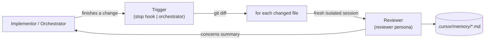

# Isolated Reviewer Loop

A self-contained setup that runs a **fresh, isolated reviewer agent** after code
changes. The reviewer documents the codebase, extracts recurring patterns, grows
an edge-case playbook, and reports concerns back to whoever made the change - all
while keeping its own persistent, cross-session memory.

It comes in two interchangeable forms that share the same reviewer persona and the
same memory:

- **In-IDE** - runs inside Cursor using Rules + Hooks + Subagents. No extra code.
- **SDK** - a standalone TypeScript program (`tools/reviewer/`) on the
  [Cursor SDK](https://cursor.com/docs/sdk/typescript) for terminal/CI use.

## The idea

An implementor (you, or an agent) makes a change. A reviewer then runs in a *fresh
session per file* - it has no memory of why the change was made, only the code in
front of it plus the shared memory on disk. That independence is the point: it
judges what is actually there.



The reviewer's "isolated rules + memory" are:

- a dedicated **persona** (`.cursor/rules/reviewer.mdc`) - its mandate and checklist,
- **persistent markdown memory** (`.cursor/memory/*.md`) that survives across sessions.

The reviewer never edits source code. Its only writes are to the memory files (and
in the SDK flow, even those are funneled through a single writer to avoid races).

## Repository layout

```
.cursor/
  rules/reviewer.mdc          Reviewer persona: mandate, checklist, output contract
  memory/
    architecture.md           Map of the codebase (modules, data flow, boundaries)
    patterns.md               Recurring patterns the reviewer extracts (good / anti)
    playbook.md               Edge cases + recommended handling ("touch X -> watch Y")
    concerns.md               Append-only log of concerns per review
  commands/document-codebase.md   /document-codebase: initial whole-repo pass
  hooks.json                  Registers the stop hook
  hooks/review-changed.sh     Diffs changed files; asks the agent to review each one
tools/reviewer/               SDK orchestrator (see tools/reviewer/README.md)
```

## How it works

### In-IDE (start here)

1. **Seed the memory.** In a Cursor chat in this repo, run `/document-codebase`
   once. It launches an isolated reviewer subagent that maps the codebase into
   `architecture.md` / `patterns.md` / `playbook.md`.
2. **Work normally.** When the agent finishes a turn, the `stop` hook
   (`.cursor/hooks/review-changed.sh`) computes the changed files via `git diff`,
   skips excluded paths (`.cursor/`, `node_modules`, build output, lockfiles), and
   returns a follow-up message asking the agent to launch one fresh reviewer
   subagent **per changed file**.
3. **Read the concerns.** Each reviewer reviews a single file, updates the memory,
   and returns a severity-ordered concerns summary; the agent consolidates them
   for you. A content-signature state file plus `loop_limit` prevent re-review
   loops.

> First run only: reload/restart Cursor so it picks up `hooks.json`, then check the
> Hooks settings tab to confirm the hook loaded.

### SDK (terminal / CI)

The same loop without the IDE. A durable implementor agent makes a change, then a
genuinely separate `Agent.prompt(...)` reviewer runs per changed file in parallel,
and concerns are fed back to the implementor.

```bash
cd tools/reviewer
npm install
export CURSOR_API_KEY="cursor_..."        # Cursor Dashboard -> Integrations

npm run review -- "Add input validation to add()"   # implement + review
npm run review -- --review-only                      # just review the current diff
```

See [`tools/reviewer/README.md`](tools/reviewer/README.md) for flags, env tuning,
and design notes.

## The memory files

These four files are the long-term memory. Every reviewer reads them for context
and contributes back:

| File              | Purpose                                                        |
| ----------------- | -------------------------------------------------------------- |
| `architecture.md` | Where each module fits; data flow; boundaries                  |
| `patterns.md`     | Named recurring patterns, "good" or "anti"                     |
| `playbook.md`     | Edge cases and how to handle them when you touch related code  |
| `concerns.md`     | Append-only, timestamped log of findings per review            |

Concern severities: `BLOCKER` > `MAJOR` > `MINOR` > `NIT` (`NONE` when clean).

## Customizing

- **Reviewer behavior**: edit the persona and checklist in
  [`.cursor/rules/reviewer.mdc`](.cursor/rules/reviewer.mdc).
- **What gets reviewed**: the exclusion list lives in two hand-synced places -
  `EXCLUDE_RE` in [`.cursor/hooks/review-changed.sh`](.cursor/hooks/review-changed.sh)
  and `EXCLUDE` in [`tools/reviewer/src/git.ts`](tools/reviewer/src/git.ts). Change
  both together.
- **Diff base**: the hook diffs against `HEAD` by default; the SDK accepts
  `--base <ref>`.

## Requirements

- A `git` repository (change detection uses `git diff`).
- Cursor, for the in-IDE flow.
- Node >= 18 and a `CURSOR_API_KEY`, for the SDK flow.

## Status

Early/experimental. The in-IDE loop and the SDK orchestrator both work end to end;
open items and known limitations are tracked in `.cursor/memory/concerns.md`.
